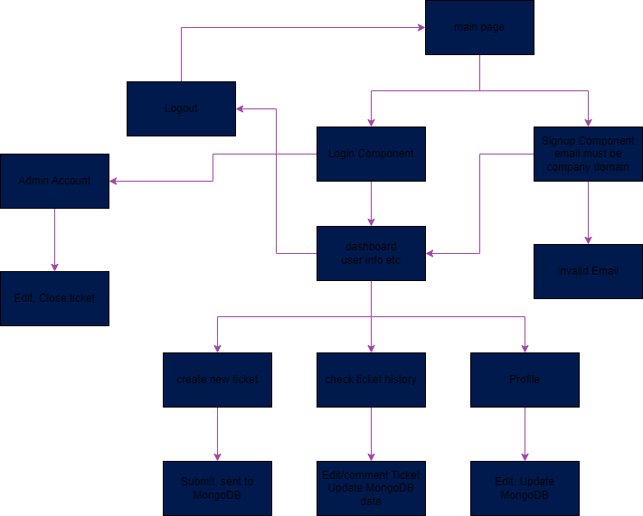

# **IT Ticket System**

### The goal of the project is to utilize MERN stack to create a Single Page Application (SPA) using ReactJS for frontend and ExpressJS for backend. The user would be able to sign up, login, create, view, edit, and delete their own tickets.

## Flow Chart Diagram:

## Technologies:

1. Framework:
    - Express JS
2. Database:
    - MongoDB
3. Environment:
    - NodeJS
4. Libraries:
    - ReactJS
    - Axios
    - React-Router-DOM
    - Mongoose
    -JsonWebToken (JWT)
    -Bcrypt
5. Others:
    - Dotenv

 